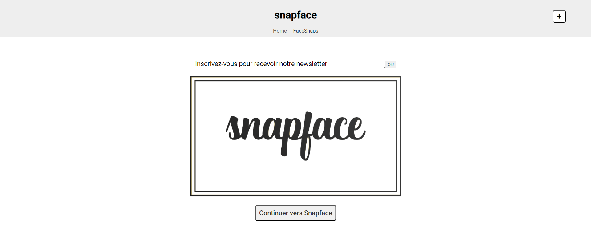

# SnapfaceWithModules

This project was generated with [Angular CLI](https://github.com/angular/angular-cli) version 17.2.1.

This version is bootstrapped with modules.
The version with standalone components is available [here](https://github.com/ZhannaZucher/snapface-angular-app)

## Project setup

### 1. Backend

Instal the source code cloning it from [here](https://github.com/OpenClassrooms-Student-Center/angular-intermediate-backend)

Run `npm install` and `npm run start` for a dev server. Navigate to `http://localhost:3000/`.

### 2. Frontend

Clone this project from [here](https://github.com/ZhannaZucher/snapface-angular-app) then run `npm install` and `ng serve` for a dev server. Navigate to `http://localhost:4200/`.
